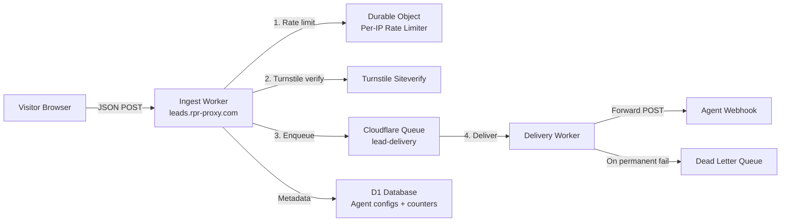
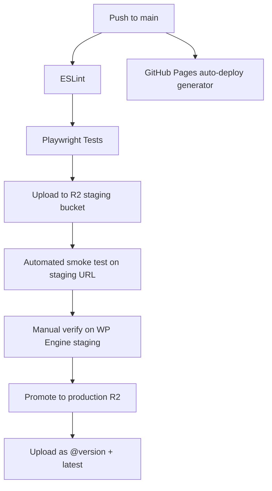

# RPR Market Reports Embed Widget — Improvement & Scalability Plan

**Prepared for:** Reggie Nicolay
**Date:** May 21, 2026
**Version:** 2.0 — Validated against industry research

---

## Competitive Landscape & Validation

Research across **splitforms**, **Typeform**, **Jotform**, **OrbitForms**, **AntForms**, and **KvCORE** confirms the plan is well-aligned with industry direction, and reveals two gaps in the original plan worth adding:

**What competitors do that RPR currently lacks:**

- splitforms (closest competitor) offers free webhooks + CRM integration on every tier, but critically uses a **server-side form backend** (`splitforms.com/api/submit`) — not direct client-side webhook POST. This is exactly the Worker proxy pattern we propose in Phase 2.
- Every serious form platform (Typeform, Jotform, HubSpot Forms) routes submissions through their own servers. **No production-grade form tool POSTs directly from the browser to the agent's endpoint.** RPR is alone in doing this, and it is the root cause of the CORS, retry, and webhook-exposure problems.
- splitforms and competitors offer **sub-10-second SMS alerts** as a standard feature. In real estate, speed-to-lead is critical — industry research shows 37% of phone-number form fields cause abandonment, but agents who respond within 5 minutes are 100x more likely to convert. Our plan adds SMS alerting as a Phase 4 feature via the proxy.

**What RPR does better:**

- Zero-dependency single `<script>` tag (vs. iframe embeds or JavaScript SDKs with dependencies)
- Purpose-built for RPR reports (area selection maps directly to report URLs)
- 12 delivery method options with inline setup guides (no competitor matches this breadth of self-serve setup)
- $0 total infrastructure cost (unmatched — splitforms charges $5/mo at 5K submissions)

**Production Cloudflare Worker patterns validated:**

- Cloudflare Queues (not Durable Objects) is the correct retry mechanism — provides at-least-once delivery, configurable batch sizes, dead letter queues, and auto-scaling consumers.
- The hookflare open-source project demonstrates the full pattern: ingest Worker + D1 for metadata + R2 for payload archive + Queues for async delivery + circuit breaker per destination.
- Critical production bug pattern: unwaited async operations in Worker contexts cause silent message loss. All retry/queue operations must be awaited before the request context terminates.

**Client-side retry (localStorage queue) validated as interim:**

- The `segmentio/localstorage-retry` pattern is production-proven (used by Segment.io in their analytics.js). It maintains per-tab queues with cross-tab coordination, exponential backoff, and configurable max attempts. This is a viable interim solution before the Worker proxy is built — prevents lead loss on transient network failures without any server infrastructure.

---

## Current State Assessment

The widget is well-built for its initial scope: zero-dependency, client-side-only, zero infrastructure cost. However, scaling to thousands of agent deployments exposes critical gaps in **lead reliability**, **abuse resistance**, **observability**, and **deployment safety**. The analysis uncovered **7 high-severity issues**, **10 medium-severity issues**, and several UX bugs.

The most urgent finding: **direct client-side webhook POST is architecturally unique in the industry — no production-grade competitor does this.** Every other form platform routes through a server-side backend. This single architectural gap is the root cause of 5 of the 7 high-severity issues.

---

## Phase 1 — Critical Bug Fixes & Security Hardening

Fixes that should ship before broader adoption. Zero infrastructure cost, high impact on correctness.

### 1.1 Fix silent lead loss on HTTP errors (HIGH)

**Problem:** When the webhook returns 4xx/5xx, the widget logs a warning but proceeds to step 2 and sets `_rprSubmitted = true`. The visitor sees "success" but the lead is silently lost. This is the single worst bug in the codebase — it creates a false sense of delivery.

**Fix:** Treat `!res.ok` the same as a network error — show the retry message and do not advance to step 2. Consider distinguishing between retriable (5xx) and non-retriable (4xx) errors in the user message.

### 1.2 Fix duplicate webhook race condition (HIGH)

**Problem:** The submit button is re-enabled before the submission lock is set. A fast double-click between those lines can fire two webhook POSTs.

**Fix:** Move the submission lock to **before** the `await fetch` call, not after. Re-enable only on retriable failure.

### 1.3 Fix Back button dead-end (MEDIUM)

**Problem:** In all display modes, clicking "Back" from step 2 shows the form but the submission flag remains `true`, blocking resubmission. Only overlay close (floating/modal) calls the reset function.

**Fix:** Back handler should call the reset function, which already handles clearing fields, errors, and the submission flag.

### 1.4 Fix Escape key resetting closed overlay (MEDIUM)

**Problem:** The global `keydown` handler calls `closeOverlay()` on every Escape press, even when the overlay is not open. This silently resets the hidden form, and multiple widget instances register duplicate listeners.

**Fix:** Guard with a check that the overlay is actually open before processing the Escape key.

### 1.5 Validate card background and text colors (MEDIUM)

**Problem:** Unlike the brand color, card background and text color values are not validated before being set as CSS custom properties. Malicious values could inject invalid CSS.

**Fix:** Apply the same hex validation with fallback to defaults (`#ffffff` and `#333333`).

### 1.6 Fix default brand color mismatch (MEDIUM)

**Problem:** Generator defaults to `#0086E6` and omits the brand color attribute when unchanged. Widget defaults to `#1a1a2e`. Agents see RPR blue in the preview but get dark navy on their deployed site.

**Fix:** Change widget default from `#1a1a2e` to `#0086E6` to match the generator. This is a visual change for existing embeds without the brand color attribute, so it should be documented as a minor breaking change in the changelog.

### 1.7 Unify HTML escaping across widget and generator (LOW)

**Problem:** Widget escapes 5 HTML entities (including single quote), generator has three separate helpers with inconsistent entity coverage.

**Fix:** Standardize on a single 5-entity escaper used consistently across both files.

### 1.8 Add input validation: phone + max-length (LOW)

**Fix:**

- Phone: when non-empty, validate against a permissive pattern that blocks nonsense but allows international formats.
- All fields: add `maxlength` attributes (name: 100, email: 254, phone: 20) to prevent oversized webhook payloads.

### 1.9 Add localStorage retry queue (MEDIUM)

**Problem:** Failed webhook submissions lose the lead permanently. The visitor sees "try again" but may not retry.

**Implementation:**

- On submission failure (network error or 5xx), store the payload in `localStorage` with a timestamp and attempt counter.
- On next widget load (same domain), check for pending retries and attempt to send them silently in the background.
- Max 3 retries with exponential backoff (1s, 5s, 30s). After 3 failures, discard.
- Cap queue at 10 items to avoid localStorage bloat.
- This is an **interim** solution. Phase 2 (Worker proxy) replaces it with server-side retry.

### 1.10 Generator: block copy when reports array is empty (MEDIUM)

**Problem:** If all report rows are incomplete (missing label or URL), the generator emits an empty reports array. The widget aborts at runtime — the agent pastes broken code with no generator-side warning.

**Fix:** When no valid reports exist, disable the Copy button, highlight the Target Areas section, and show an inline warning: "Add at least one area with a label and RPR report URL."

---

## Phase 2 — Cloudflare Worker Lead Proxy (Scalability + Security)

This is the single highest-impact architectural change. It solves webhook exposure, CORS failures, rate limiting, retry, and bot protection in one component. **Every production-grade competitor (splitforms, Typeform, Jotform) uses this pattern.**

### 2.1 Architecture (revised with Cloudflare Queues)

Research confirms **Cloudflare Queues** (not Durable Objects) is the correct retry mechanism. Queues provide at-least-once delivery, configurable batch sizes, dead letter queues, and auto-scaling consumers. Durable Objects should be used only for rate limiting.



Key architectural decisions validated by production webhook relay implementations:

- **Separate ingest and delivery Workers** — ingest responds in <100ms; delivery handles retries independently
- **Cloudflare Queues for retry** — at-least-once delivery, configurable batch/timeout, built-in DLQ support, auto-scaling consumers
- **D1 for agent config** — maps agent tokens to webhook URLs, stores rate limit config, counters
- **Durable Objects for rate limiting only** — per-IP precise global limiting with in-memory pre-check
- **All async operations must be awaited** — unwaited promises vanish when Worker context terminates (critical production bug pattern)

### 2.2 What the Worker solves

- **Webhook URL hidden** — embed code points to `https://leads.rpr-proxy.com/{agent-token}`, not the real webhook
- **CORS normalized** — browser POSTs to Worker origin only; Worker forwards server-side (no CORS preflight on the agent's endpoint)
- **Rate limiting** — per-IP + per-agent-token limits via Durable Objects
- **Retry with backoff** — Cloudflare Queues retry failed deliveries (3 attempts, exponential backoff, respects `Retry-After` headers)
- **Circuit breaker** — auto-pause delivery to unhealthy agent endpoints after N consecutive failures; auto-probe for recovery
- **Dead letter queue** — permanently failed deliveries are stored for manual inspection/replay
- **Turnstile validation** — optional bot protection attribute; Worker verifies token via Cloudflare Siteverify API
- **Idempotency** — KV-based dedup with configurable TTL prevents duplicate leads from retry or double-submit
- **Payload signing** — Worker adds HMAC signature header so agents can verify authenticity
- **Telemetry** — Worker counts loads, submissions, errors, delivery latency — zero PII

### 2.3 Embed code change

Current:

```html
data-webhook="https://hooks.zapier.com/hooks/catch/12345/abcdef/"
```

With proxy:

```html
data-proxy="https://leads.rpr-proxy.com/agt_abc123"
```

Backwards compatible: widget checks `data-proxy` first, falls back to `data-webhook` for existing deploys. The localStorage retry queue (Phase 1.9) continues to work as a client-side fallback regardless.

### 2.4 Worker cost estimate (revised)

- Workers paid plan: $5/month base
- Queues: $0.40/million operations (enqueue + dequeue)
- D1: free tier 5M reads/day, 100K writes/day
- KV: free tier 100K reads/day, 1K writes/day
- Durable Objects: $0.15/million requests (rate limiting only)
- At 10,000 agents x 5 leads/day = 50K submissions/day = ~1.5M/month = **~$5.60/month total**
- At 50,000 agents x 10 leads/day = 500K/day = 15M/month = **~$11/month total**

### 2.5 Turnstile integration details

Cloudflare Turnstile offers three modes — **Invisible** is the best fit:

- No visible widget or loading indicator
- Runs challenges entirely in background
- Zero UX friction, zero visitor interaction
- Free (unlimited usage)
- Widget loads Turnstile script only when the sitekey attribute is present
- Worker verifies token via Siteverify API before forwarding to webhook
- Requires privacy policy reference (Cloudflare Privacy Addendum)

### 2.6 Generator updates

- New "Lead Delivery" option: "RPR Proxy (recommended)" — agent registers webhook URL via a simple form, gets a proxy token
- Generator emits `data-proxy` instead of `data-webhook` when proxy is selected
- **Fix test/production mismatch:** test button uses standard CORS POST to the proxy (same as production), not `no-cors`
- Test result copy changes to "Lead delivered — check your [destination]" on actual verified success, or "Request sent — could not verify delivery" on `no-cors` fallback
- Proxy enrollment can be a simple D1 write via the Worker API (no separate auth system needed initially)

---

## Phase 3 — Infrastructure Hardening

### 3.1 Versioned CDN URLs (HIGH)

**Problem:** Single unversioned URL — a bad upload breaks every widget worldwide with no rollback.

**Solution:**

- Upload each release as a versioned file (e.g., `rpr-reports-embed@1.2.0.js`) and maintain a `latest` alias
- Generator emits the latest URL by default, but agents can pin to a version
- Keep last 10 versions on R2 for rollback
- Set up a custom domain (`cdn.narrpr.com` or `cdn.rprreports.com`) via Cloudflare for branding and DNS control
- Add appropriate `Cache-Control` headers: short TTL for the latest alias, immutable for versioned files

### 3.2 CI/CD Pipeline (HIGH)



**Implementation:**

- GitHub Actions workflow triggered on push to `main`
- ESLint config matching the project's code style
- Playwright tests covering: widget rendering in all 3 display modes, both form modes, validation, submission flow, multi-widget on same page, dark card styling
- Staging R2 bucket with its own public URL for pre-production validation
- Automated smoke test: headless browser loads staging embed, verifies DOM structure
- Manual promotion step via GitHub Actions `workflow_dispatch` (no auto-deploy to production CDN)

### 3.3 Observability / Telemetry (HIGH)

**Problem:** Zero visibility into widget deployments, conversion rates, or failures at scale. Cannot operate at thousands of deployments without this.

**Solution:** Privacy-respecting anonymous counters via the Worker proxy (Phase 2) + `navigator.sendBeacon()`:

| Event | Data sent (no PII) | Collection point |
|---|---|---|
| Widget loaded | Version, display mode, form mode, hostname hash | sendBeacon to Worker |
| Form submitted | Success/failure, form mode, area count | Worker proxy (natural) |
| Webhook delivery | Status code, latency ms, agent token | Worker proxy (natural) |
| Webhook error | Error type, status code, circuit breaker state | Worker proxy (natural) |
| DLQ entry | Agent token, failure reason, attempt count | Worker proxy (natural) |

Dashboard options: Cloudflare Analytics (free, built-in for Workers) or Grafana Cloud free tier for custom dashboards.

### 3.4 Subresource Integrity (MEDIUM)

Generate SRI hashes for versioned widget script. Generator emits `integrity` and `crossorigin="anonymous"` attributes on the script tag. Protects against CDN compromise.

**Note:** SRI is incompatible with the `latest` alias (hash changes on every release). Only works with versioned URLs. Generator should emit versioned URL when SRI is needed.

### 3.5 Secondary CDN / Self-host documentation (LOW)

Document how agents or their developers can self-host the widget script on their own domain as a fallback. Add a "Self-hosted" option to the generator that lets agents change the `src` URL.

---

## Phase 4 — Accessibility, UX Polish, Growth Features

### 4.1 Modal accessibility (MEDIUM)

- Add `role="dialog"`, `aria-modal="true"`, `aria-labelledby` pointing at headline
- Trap focus inside the overlay when open (Tab/Shift+Tab cycle within card)
- Move initial focus to the first interactive element on open
- Restore focus to the trigger element on close
- Add a visible close button (X) in the overlay top-right corner
- Add `aria-hidden="true"` to content behind the overlay when open

### 4.2 Form error accessibility (LOW)

- Add `aria-invalid="true"` to invalid fields on validation failure; remove on clear
- Add `aria-describedby` linking each field to its error message element
- Add `role="alert"` to error message elements so screen readers announce them immediately
- Add `aria-live="assertive"` to the status message element

### 4.3 Generator UX fixes (MEDIUM)

- **Empty reports guard** (covered in 1.10) — disable Copy button, show inline warning
- **Fix test webhook feedback** — when using `no-cors` mode (pre-proxy), change success message to "Request dispatched — verify in your [destination]. Note: we cannot confirm delivery in this mode." When using proxy (Phase 2), show actual delivery confirmation.
- **Add live regions** to test result and copy button feedback areas
- **Add proper ARIA roles** to form mode tabs and display mode tabs
- **Side nav focus management** — move focus to the pane heading when switching panes

### 4.4 Direct CRM integrations via proxy (LOW — Growth)

With the Worker proxy in place, add server-side integrations that were impossible client-side:

- **Follow Up Boss** — direct lead API (extremely popular with RE agents; primary audience)
- **HubSpot Forms API** — native form submission with contact creation
- **kvCORE** — real estate platform API (dominant among teams/brokerages)
- **Chime** — another popular RE CRM
- Pattern: agent selects CRM in generator, enters API key (stored encrypted in D1), proxy formats and forwards leads to the CRM API directly

### 4.5 Sub-10-second SMS lead alerts via proxy (MEDIUM)

**Research finding:** In real estate, speed-to-lead is the single most important conversion factor. Agents who respond within 5 minutes are 100x more likely to convert the lead. splitforms and other competitors highlight SMS alerts as a key feature.

**Implementation:**

- Add Twilio or Vonage integration to the Worker proxy
- Agent enters their phone number in the generator; proxy sends a formatted SMS on each lead
- Cost: ~$0.0079/SMS (Twilio) = ~$4/month for an agent getting 500 leads/month
- Could be a premium feature to offset proxy infrastructure costs

---

## Lead Delivery: Is There a Better Way Than Webhooks?

**Short answer:** Webhooks are the right primary mechanism, but they need a server-side proxy layer in front of them. This is not just our recommendation — it is what **every production-grade competitor** does.

| Approach | Verdict | Industry validation |
|---|---|---|
| **Current: direct client-side webhook** | Breaks on CORS, no retry, exposed URL, no rate limiting | No competitor does this in production |
| **Worker proxy + webhook forwarding** | Best upgrade — keeps flexibility, adds reliability | splitforms, Typeform, Jotform all use server-side form backends |
| **Worker proxy + Cloudflare Queues** | Best retry mechanism — at-least-once delivery, DLQ, auto-scale | Validated by CF docs + hookflare + EventDock production experience |
| **Direct CRM APIs (via proxy)** | Good Phase 4 add-on for Follow Up Boss, HubSpot, kvCORE | splitforms offers free CRM webhooks as a differentiator |
| **localStorage retry queue** | Viable interim before proxy; prevents ~80% of transient failures | Proven by Segment.io (segmentio/localstorage-retry) |
| **Message queue (SQS, Pub/Sub)** | Overkill as direct browser target; natural fit behind proxy | CF Queues is the right choice within the CF ecosystem |
| **Client-side email (EmailJS)** | API keys exposed; limited free tiers | Rejected by design — validated by industry consensus |
| **Firebase/Supabase** | Good for optional lead dashboard; not a webhook replacement | Adds data custody obligations; better as a future paid tier |
| **SMS alerts (Twilio via proxy)** | High-value add-on for RE agents; speed-to-lead is critical | splitforms, Follow Up Boss, and RE-specific tools all offer this |

---

## Scalability Assessment

### What scales well today

- CDN cost ($0 egress on R2; ~12KB gzipped script caches at edge globally)
- Client-side execution (zero server CPU per widget load or form render)
- Agent isolation (each agent's webhook is independent)
- No user accounts, no database, no session state

### What breaks at thousands of deployments

- **No rollback on bad CDN upload** — blast radius = all widgets worldwide
- **No monitoring** — blind to failure rates, adoption, conversion
- **Direct browser-to-webhook is unique in the industry** — every competitor proxies through their own servers for reliability, CORS, and abuse prevention
- **Bot abuse scales linearly** with visible webhook URLs in page source
- **Google Sheets quota cliffs** — ~90 min runtime/day, 50MB sheet cap, `appendRow` concurrency limits
- **Generator test gives false confidence** — `no-cors` + `text/plain` test vs. CORS + `application/json` production
- **Support burden from CORS misconfiguration** scales with the long tail of agent-chosen endpoints
- **Silent lead loss on HTTP errors** — agents don't know they're losing leads

### What the Worker proxy resolves

The proxy centralizes the outbound POST, solving 5 of 7 high-severity issues:

- Webhook URL hidden
- CORS eliminated (browser only talks to proxy origin)
- Rate limiting + Turnstile bot protection
- Retry via Queues + DLQ
- Telemetry at proxy layer
- Circuit breaker prevents hammering dead endpoints
- Single monitoring point for all agents

### Cost at scale

| Scale | Submissions/month | Estimated cost |
|---|---|---|
| 1,000 agents x 5 leads/day | 150K | ~$5/month (Workers base) |
| 10,000 agents x 5 leads/day | 1.5M | ~$6/month |
| 50,000 agents x 10 leads/day | 15M | ~$12/month |
| 100,000 agents x 10 leads/day | 30M | ~$20/month |

Cloudflare's pricing model (pay-per-request with generous free tiers) means the proxy scales near-linearly with lead volume at negligible cost.

---

## Priority Summary

| Phase | Impact | Dependencies | Items |
|---|---|---|---|
| **Phase 1: Bug fixes + hardening** | High — prevents lead loss, fixes UX dead-ends | None | 10 items |
| **Phase 2: Worker proxy** | Critical — solves security, reliability, CORS, abuse | Cloudflare account | 4 items |
| **Phase 3: Infra hardening** | High — versioned CDN, CI/CD, monitoring | Phase 2 (telemetry via Worker) | 5 items |
| **Phase 4: A11y, UX, CRM** | Medium — polish, accessibility, growth features | Phase 2 (CRM/SMS need proxy) | 5 items |

Phase 1 can begin immediately with zero infrastructure changes. Phase 2 is the architectural inflection point. Phases 3 and 4 build on the proxy foundation.
